<h4 align="center"> 
	🚧 Aplicativos 🚀
</h4> 

<h1 align="center">
    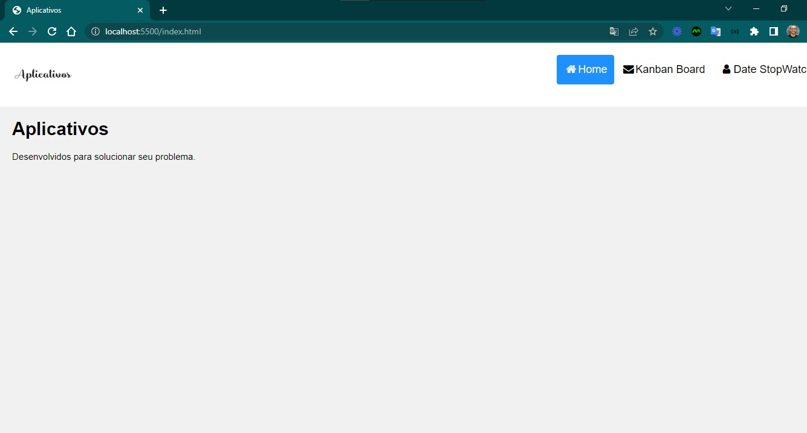
</h1>

Criado um template Responsive Design para reunir em uma aplicação duas funcionalidades criadas com html, css e javascript: stopwatch e kanban.

#### Requisitos

- [x] design personalizado
- [x] responsividade
- [ ] favicon

- gradientes
````css
    background: rgb(255, 212, 123);
    background: radial-gradient(
        circle,
        rgba(255, 212, 123, 1) 0%,
        rgba(255, 71, 145, 1) 100%
    );
````

#### Telas

- desktop

<p align="center" style="display: flex; align-items: flex-start; justify-content: center;">
  
  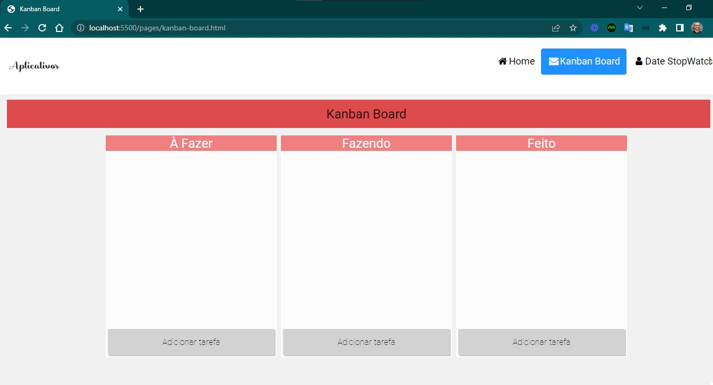
  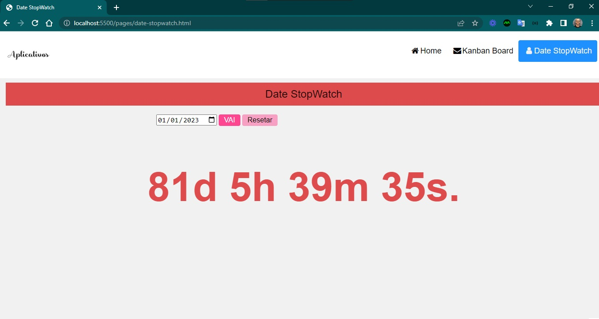
</p>

- mobile

<p align="center" style="display: flex; align-items: flex-start; justify-content: center;">
  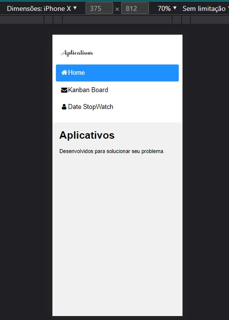
  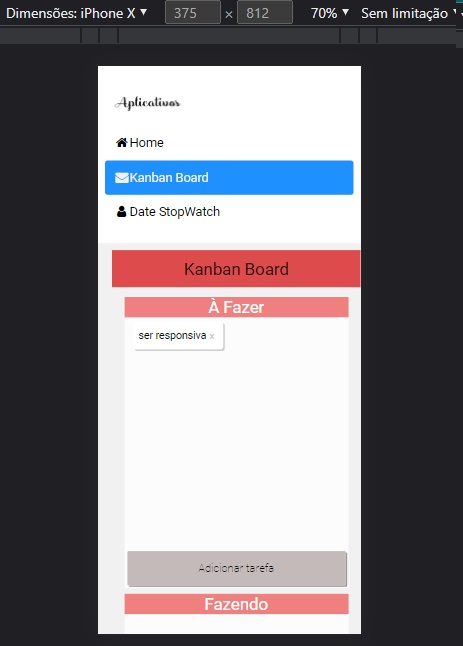
  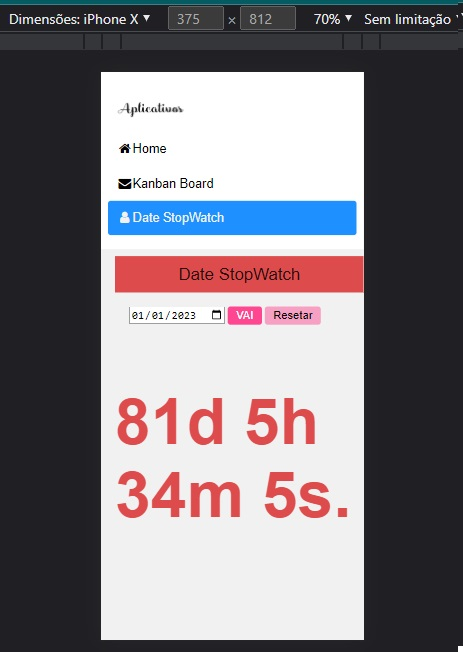
</p>

---  

<h4 align="center"> 
	🚧 Date Stopwatch 🚀
</h4> 

<h1 align="center">
    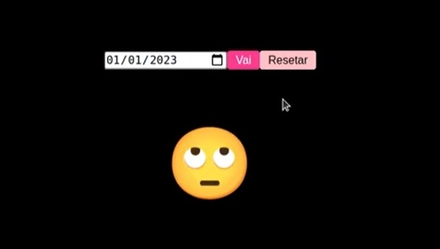
</h1>

### 💻 Sobre o projeto

- Desenvolver um cronômetro online salvando dados no navegador com html, css e javascript.
- Utilizar o template do layout a seguir para construir.
<p align="center" style="display: flex; align-items: flex-start; justify-content: center;">
  
  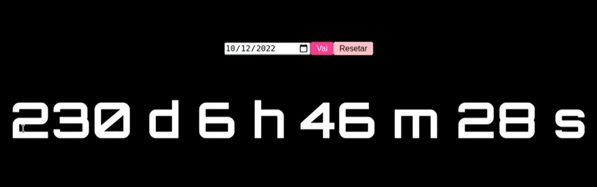
</p>
- O fluxo da aplicação é a seguinte:
<p align="center" style="display: flex; align-items: flex-start; justify-content: center;">
  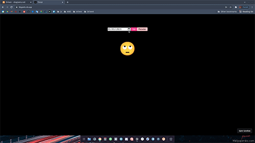
</p>
- Inspiração: Desafio da Driven em construir aplicações com os fundamentos de js, html e js em um espaço curto de tempo.

### 🛠 Construindo 

- A estrutura html
- A estilização css
- A lógica de cálculo de datas em javascript
- O botão resetar para retornar o h1 e limpar esse contador
- Fazer a chamada para a função para um efeito cronômetro
- Apagar o processo de contador
- Usar o localstorage para memorizar o contador 
- Usar o localstorage para resgatar o contador 
- Usar o localstorage para limpar o contador 

### 😯 Finalizado 

- Terminamos o segundo desafio da driven. Dessa vez, com um pouco mais complexidade na lógica da aplicação. Vamos para o próximo.

<p align="center" style="display: flex; align-items: flex-start; justify-content: center;">
  
  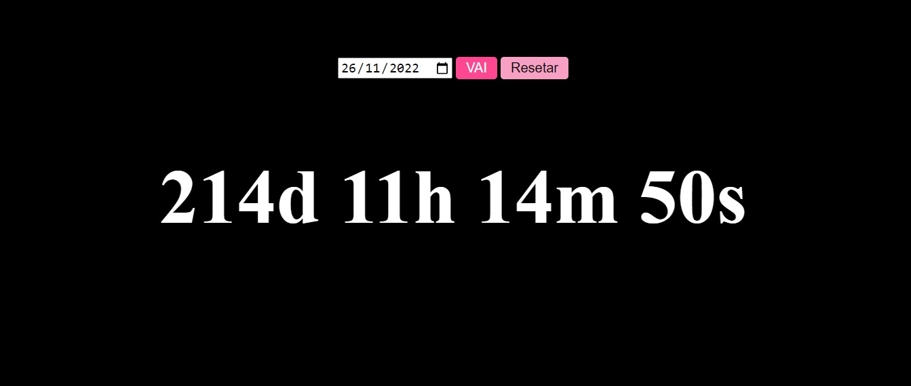
</p>

### 🧭 Adicionado

- Editando os elementos html para tags semânticas

### 💻 Próximo passo

- aperfeiçoar o layout do cronômetro aplicando princípios de ux. 
- responsividade
- acessibilidade
- modo dark / light
- variação de cores

---  

<h4 align="center"> 
	🚧 Kanban Board 🚀
</h4> 

<h1 align="center">
    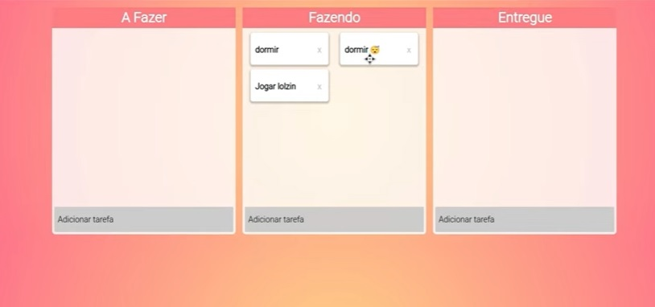
</h1>

### 💻 Sobre o projeto

- Desenvolver um kanban de tarefas com html, css e javascript.
- Utilizar o template do layout a seguir para construir.
<p align="center" style="display: flex; align-items: flex-start; justify-content: center;">
  
</p>
- O fluxo da aplicação é a seguinte:
<p align="center" style="display: flex; align-items: flex-start; justify-content: center;">
  
</p>
- Inspiração: Desafio da Driven em construir aplicações com os fundamentos de js, html e js em um espaço curto de tempo.

### 🛠 Construindo 

- estrutura em html
- estilização em css
- google font com @import
- lógica em javascript: adicionar tarefa
- lógica em javascript: remover tarefa
- lógica em javascript: arrastar tarefa entre os quadros

### 😯 Finalizado 

- Terminamos o terceiro desafio da driven. Nessa última tarefa foi utilizado recursos mais interessantes do javascript, manipulando com movimentos alguns elementos de tela.

<p align="center" style="display: flex; align-items: flex-start; justify-content: center;">
  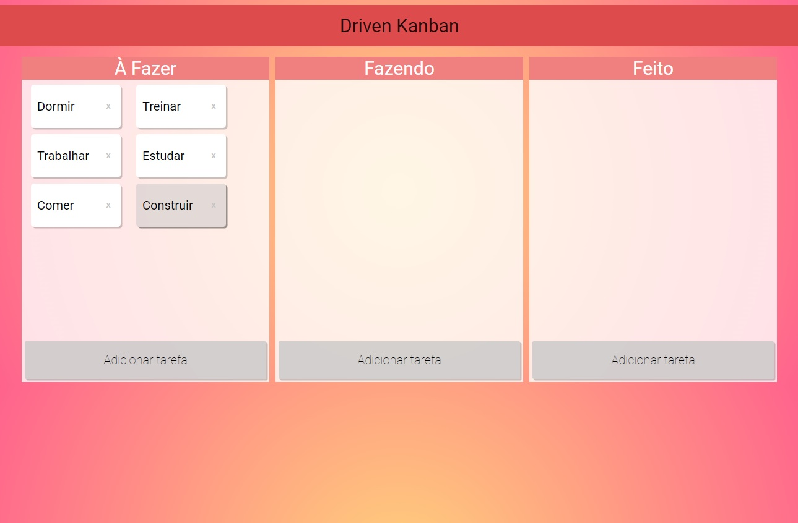
  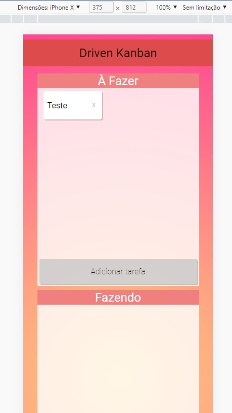
</p>

### 🧭 Adicionado

- Editando os elementos html para tags semânticas
- Utilizando medidas fluídas ao invés de medidas fixas
- Mobile first

### 💻 Próximo passo

- guardar as informações das tarefas no localStorage para recuperar em curto prazo 
- responsividade
- acessibilidade
- modo dark / light
- variação de cores

---  

Feito com ❤️ por Douglas A B Novato 👋🏽 [Entre em contato!](https://www.linkedin.com/in/douglasabnovato/) :wave: 

Fonte do Projeto: [Driven](https://www.driven.com.br/)