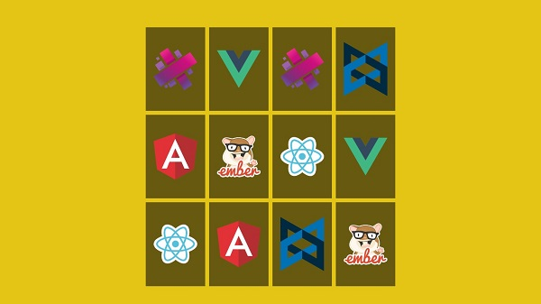

<h3 align="center">
  Jogo de Memória  🚀
</h3>

---
 

### O que é a aplicação

- Aplicação do tradicional jogo da memória com a lógica desenvolvida em Javascript.

#### Tecnologias/ Ferramentas/ Bibliotecas

- HTML: estrutura
- Javascript: lógica e comportamento
- CSS: posicionamento, dimensionamento e muito mais.

#### Código + Dependências

- git clone "http": ter o projeto na máquina local
- open with live server

#### Passo a passo do projeto - Frontend 

- [x] 1. Estrutura HTML 
- [x] 2. Estilização CSS 
- [x] 3. Lógica em Javascript

#### Próximo passo na aplicação

- Link para o artigo da aplicação 

#### Anotações   

- Fonte do projeto: [Memory Game in Vanilla JavaScript](https://www.freecodecamp.org/news/vanilla-javascript-tutorial-build-a-memory-game-in-30-minutes-e542c4447eae)

---
 

.: Por [Douglas A B Novato](https://linktr.ee/douglasabnovato)