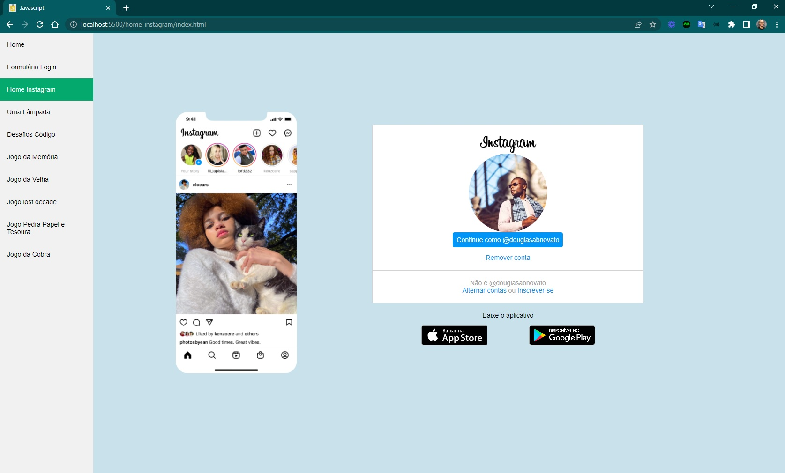

<h4 align="center"> 
	🚧 Fundamentos de Javascript 🚀
</h4>

  

  

Praticar e estudar os fundamentos de javascript.
Criado um template para demonstrar esses projetos.

- [x] Home
- [x] Formulário Login
- [x] Home Instagram
- [x] Uma Lâmpada
- [x] Desafios Código
- [x] Curso em Vídeo
- [x] DIO + Spread Fullstack Developer
- [x] Jogo da Memória
- [x] Jogo da Velha
- [x] Jogo Lost Decade
- [x] Jogo Pedra Papel e Tesoura
- [x] Jogo da Cobra 
- [x] Driven Aplicações
- [x] Rocketseat - Desafio HTML

#### Requisitos

- [ ] design personalizado
- [ ] responsividade
- [ ] favicon
- [ ] páginas para conteúdos
- [ ] ícone de [esconder menu](https://www.w3schools.com/howto/tryit.asp?filename=tryhow_js_responsive_navbar_dropdown)

#### Referências 
- [web.dev / Learn Responsive Design](https://web.dev/learn/design/)
- [web.dev / Learn Css](https://web.dev/learn/css/)
- [web.dev / Learn Forms](https://web.dev/learn/forms/)
- [web.dev / Learn pwa](https://web.dev/learn/pwa/)

Feito com ❤️ por Douglas A B Novato 👋🏽 [Entre em contato!](https://www.linkedin.com/in/douglasabnovato/)
